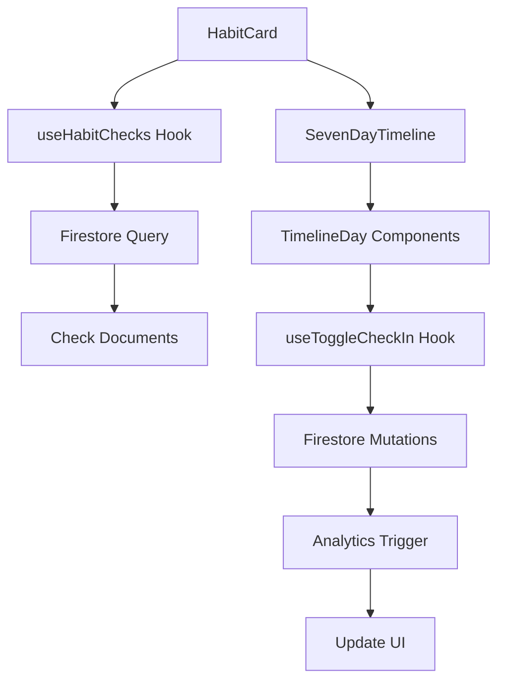

# Design Document

## Overview

The 7-Day Check-In Adjustment feature adds an interactive timeline to each habit card on the dashboard, allowing users to view and modify their check-in status for the previous 7 days. The design integrates seamlessly with the existing glassmorphism UI theme and provides an intuitive multi-touch toggle interface that cycles through three states: skip (no check-in), done (completed), and not done (failed).

This feature enhances user flexibility by enabling retroactive corrections to their habit tracking data without requiring navigation to separate pages. The implementation leverages existing Firebase infrastructure and React Query patterns while introducing new UI components and state management logic.

## Architecture

### Component Structure

```
HabitCard (existing, modified)
├── SevenDayTimeline (new component)
│   ├── TimelineDay (new component)
│   │   ├── Date display
│   │   ├── Status indicator
│   │   └── Touch handler
│   └── Timeline container
└── Existing card content
```

### Data Flow



### State Management

- **Local State**: Timeline expansion/collapse state, optimistic UI updates
- **React Query Cache**: Check-in documents, analytics data
- **Firestore**: Source of truth for check-in records

## Components and Interfaces

### 1. SevenDayTimeline Component

**Purpose**: Container component that displays the 7-day timeline and manages the overall timeline state.

**Props**:
```typescript
interface SevenDayTimelineProps {
  habitId: string
  habitStartDate: Timestamp
  habitColor?: string
  isBreakHabit: boolean
}
```

**Responsibilities**:
- Calculate the 7-day date range based on current date and habit start date
- Fetch check-in data for the 7-day period
- Render TimelineDay components for each date
- Handle loading and error states
- Provide visual container with glassmorphism styling

**Visual Design**:
- Vertical layout with dates stacked from most recent (top) to oldest (bottom)
- Glassmorphism card with subtle backdrop blur
- Smooth expand/collapse animation
- Responsive spacing for mobile and desktop

### 2. TimelineDay Component

**Purpose**: Individual day item that displays date information and handles status toggling.

**Props**:
```typescript
interface TimelineDayProps {
  date: string // YYYY-MM-DD format
  status: 'skip' | 'done' | 'not_done'
  habitId: string
  habitColor?: string
  isBreakHabit: boolean
  onStatusChange: (date: string, newStatus: 'skip' | 'done' | 'not_done') => void
  isLoading: boolean
}
```

**Responsibilities**:
- Display date in readable format (e.g., "Mon 15")
- Show appropriate status icon based on current state
- Handle tap/click events to cycle through states
- Provide optimistic UI feedback
- Display loading spinner during mutation
- Show error state if mutation fails

**Visual Design**:
- Minimum touch target: 44x44 pixels
- Three distinct visual states:
  - **Skip**: Gray circle with dash icon
  - **Done**: Green circle with checkmark (or red for break habits)
  - **Not Done**: Red circle with X icon (or orange for break habits)
- Smooth color transitions between states
- Subtle scale animation on tap
- Disabled state with reduced opacity during loading

### 3. useToggleCheckIn Hook

**Purpose**: Custom hook that manages check-in status toggling logic and Firestore mutations.

**Interface**:
```typescript
interface UseToggleCheckInReturn {
  toggleStatus: (habitId: string, date: string, currentStatus: 'skip' | 'done' | 'not_done') => Promise<void>
  isPending: boolean
  error: Error | null
}

function useToggleCheckIn(): UseToggleCheckInReturn
```

**Logic**:
```typescript
// State transition logic
const getNextStatus = (current: 'skip' | 'done' | 'not_done'): 'skip' | 'done' | 'not_done' => {
  if (current === 'skip') return 'done'
  if (current === 'done') return 'not_done'
  return 'skip'
}

// Mutation logic
const toggleStatus = async (habitId, date, currentStatus) => {
  const nextStatus = getNextStatus(currentStatus)
  
  if (nextStatus === 'skip') {
    // Delete check document
    await deleteCheckIn(habitId, date)
  } else if (nextStatus === 'done') {
    // Create or update check document with completed status
    await createCheckIn(habitId, date, { status: 'done' })
  } else {
    // Create or update check document with not_done status
    await createCheckIn(habitId, date, { status: 'not_done' })
  }
  
  // Trigger analytics recalculation
  await triggerAnalyticsUpdate(habitId)
}
```

### 4. useHabitChecks Hook (Enhanced)

**Purpose**: Fetch check-in data for a specific habit with date range filtering.

**Enhanced Interface**:
```typescript
interface UseHabitChecksOptions {
  habitId: string
  startDate?: string // YYYY-MM-DD
  endDate?: string // YYYY-MM-DD
}

interface CheckInWithStatus extends CheckIn {
  status?: 'done' | 'not_done' // Add status field
}

function useHabitChecks(options: UseHabitChecksOptions): UseQueryResult<CheckInWithStatus[]>
```

**Enhancements**:
- Add optional date range filtering
- Include status field in check-in documents
- Optimize query to fetch only required dates
- Cache results efficiently with React Query

## Data Models

### Check Document Structure (Enhanced)

```typescript
interface CheckDocument {
  dateKey: string // YYYY-MM-DD (document ID)
  completedAt: Timestamp
  habitId: string
  status: 'done' | 'not_done' // NEW: Explicit status field
}
```

**Firestore Path**: `/users/{uid}/habits/{habitId}/checks/{dateKey}`

**Changes**:
- Add `status` field to distinguish between "done" and "not done"
- Maintain backward compatibility: documents without status field default to "done"
- "Skip" state represented by absence of document

### Timeline State Model

```typescript
interface TimelineState {
  dates: Array<{
    dateKey: string
    dayName: string
    dayNumber: number
    status: 'skip' | 'done' | 'not_done'
    isToday: boolean
  }>
  isExpanded: boolean
  isLoading: boolean
  error: Error | null
}
```

## Error Handling

### Mutation Failures

**Strategy**: Optimistic UI with rollback on error

```typescript
const handleStatusToggle = async (date: string, currentStatus: Status) => {
  // 1. Optimistic update
  setOptimisticStatus(date, getNextStatus(currentStatus))
  
  try {
    // 2. Perform mutation
    await toggleStatus(habitId, date, currentStatus)
  } catch (error) {
    // 3. Rollback on error
    setOptimisticStatus(date, currentStatus)
    
    // 4. Show error message
    showErrorToast('Failed to update check-in. Please try again.')
  }
}
```

### Network Errors

- Display inline error message below timeline
- Provide retry button
- Queue mutations for offline sync using Firestore offline persistence
- Show sync status indicator

### Permission Errors

- Display clear error message
- Suggest re-authentication if needed
- Log error for debugging

## Testing Strategy

### Unit Tests

**Components**:
- `SevenDayTimeline.test.tsx`: Test date calculation, rendering, loading states
- `TimelineDay.test.tsx`: Test status display, toggle interaction, accessibility
- `useToggleCheckIn.test.ts`: Test state transitions, mutation logic, error handling

**Test Cases**:
```typescript
describe('TimelineDay', () => {
  it('should display correct icon for each status', () => {})
  it('should cycle through states on tap', () => {})
  it('should show loading spinner during mutation', () => {})
  it('should rollback on mutation error', () => {})
  it('should meet minimum touch target size', () => {})
  it('should announce status changes to screen readers', () => {})
})

describe('useToggleCheckIn', () => {
  it('should transition from skip to done', () => {})
  it('should transition from done to not_done', () => {})
  it('should transition from not_done to skip', () => {})
  it('should create check document for done status', () => {})
  it('should update check document for not_done status', () => {})
  it('should delete check document for skip status', () => {})
  it('should trigger analytics update after mutation', () => {})
  it('should handle Firestore errors gracefully', () => {})
})
```

### Integration Tests

**Scenarios**:
- Toggle status and verify Firestore document changes
- Verify analytics recalculation after status change
- Test offline behavior with queued mutations
- Test concurrent status changes on multiple dates

### E2E Tests

**User Flows**:
1. User views habit card with 7-day timeline
2. User taps on a date to mark as done
3. User taps again to mark as not done
4. User taps again to remove check-in (skip)
5. Verify analytics update correctly

## Performance Considerations

### Query Optimization

**Strategy**: Fetch only required data

```typescript
// Efficient query for 7-day range
const fetchSevenDayChecks = async (habitId: string, startDate: string, endDate: string) => {
  const checksRef = collection(db, 'users', uid, 'habits', habitId, 'checks')
  const q = query(
    checksRef,
    where('dateKey', '>=', startDate),
    where('dateKey', '<=', endDate)
  )
  return getDocs(q)
}
```

**Caching**:
- Use React Query's stale-while-revalidate strategy
- Cache timeline data for 30 seconds
- Invalidate cache on mutations

### Rendering Optimization

**Techniques**:
- Memoize TimelineDay components with `React.memo`
- Use `useMemo` for date calculations
- Debounce rapid status toggles
- Virtualize timeline if extended beyond 7 days in future

### Animation Performance

**Approach**:
- Use CSS transforms for animations (GPU-accelerated)
- Limit animations to opacity and transform properties
- Use `will-change` CSS property sparingly
- Target 60fps for all animations

## Accessibility

### Keyboard Navigation

- Timeline days focusable with Tab key
- Space/Enter to toggle status
- Arrow keys to navigate between days

### Screen Reader Support

**ARIA Labels**:
```typescript
<button
  role="button"
  aria-label={`${dayName} ${dayNumber}, status: ${status}. Tap to change.`}
  aria-pressed={status === 'done'}
  onClick={handleToggle}
>
  {/* Status icon */}
</button>
```

**Announcements**:
- Announce status changes: "Monday 15 marked as done"
- Announce errors: "Failed to update check-in for Monday 15"

### Visual Accessibility

- Color contrast ratio ≥ 4.5:1 for text
- Color contrast ratio ≥ 3:1 for UI components
- Don't rely solely on color to convey status (use icons)
- Support high contrast mode
- Respect reduced motion preferences

## Mobile Considerations

### Touch Interactions

- Minimum touch target: 44x44 pixels
- Adequate spacing between timeline days (8px minimum)
- Haptic feedback on status change (if supported)
- Prevent accidental taps with debouncing

### Responsive Design

**Breakpoints**:
- Mobile (< 640px): Full-width timeline, larger touch targets
- Tablet (640px - 1024px): Compact timeline, standard touch targets
- Desktop (> 1024px): Hover states, smaller visual elements

### Performance on Mobile

- Lazy load timeline data
- Minimize re-renders
- Use efficient animations
- Test on low-end devices

## Integration with Existing Features

### Analytics Engine

**Trigger Points**:
- After any check-in status change
- Recalculate current streak
- Recalculate longest streak
- Recalculate completion rate

**Implementation**:
```typescript
// Reuse existing analytics calculator
import { updateHabitAnalytics } from '../utils/analyticsCalculator'

const handleStatusChange = async (habitId: string, date: string) => {
  // ... perform mutation ...
  
  // Trigger analytics update
  const habitDoc = await getDoc(doc(db, 'users', uid, 'habits', habitId))
  if (habitDoc.exists()) {
    await updateHabitAnalytics(uid, habitId, habitDoc.data().startDate)
  }
}
```

### Existing Check-In Buttons

**Behavior**:
- Today's quick action buttons remain on card
- Timeline provides historical adjustment
- Both use same underlying mutations
- Consistent feedback and error handling

### Habit Detail Page

**Consideration**:
- Timeline graph on detail page should reflect status changes
- Ensure data consistency between dashboard and detail page
- Consider adding similar timeline to detail page in future

## Visual Design Specifications

### Color Palette

**Build Habits**:
- Skip: `bg-gray-200 dark:bg-gray-700` with dash icon
- Done: `bg-green-500` with checkmark icon
- Not Done: `bg-red-500` with X icon

**Break Habits**:
- Skip: `bg-gray-200 dark:bg-gray-700` with dash icon
- Done: `bg-red-500` with shield/checkmark icon
- Not Done: `bg-orange-500` with X icon

### Typography

- Date labels: `text-sm font-medium`
- Day names: `text-xs uppercase tracking-wide`
- Error messages: `text-xs text-red-600`

### Spacing

- Timeline container padding: `p-4`
- Gap between days: `gap-2` (8px)
- Icon size: `w-5 h-5`
- Touch target: `min-w-[44px] min-h-[44px]`

### Animations

**Status Change**:
```css
.timeline-day {
  transition: all 0.2s ease-out;
}

.timeline-day:active {
  transform: scale(0.95);
}

.status-icon {
  transition: opacity 0.15s, transform 0.15s;
}
```

**Expand/Collapse**:
```css
.timeline-container {
  transition: max-height 0.3s ease-in-out, opacity 0.2s;
}
```

## Implementation Phases

### Phase 1: Core Timeline Display
- Create SevenDayTimeline component
- Create TimelineDay component
- Implement date calculation logic
- Display static timeline with current check-in status
- Add to HabitCard component

### Phase 2: Status Toggling
- Implement useToggleCheckIn hook
- Add tap handlers to TimelineDay
- Implement optimistic UI updates
- Connect to Firestore mutations
- Add loading states

### Phase 3: Analytics Integration
- Enhance check document structure with status field
- Update analytics calculator to handle not_done status
- Trigger analytics recalculation on status changes
- Update UI to reflect new analytics

### Phase 4: Error Handling & Polish
- Add error handling and rollback logic
- Implement retry mechanism
- Add user feedback (toasts, animations)
- Optimize performance
- Add accessibility features

### Phase 5: Testing & Refinement
- Write unit tests
- Write integration tests
- Conduct user testing
- Fix bugs and refine UX
- Performance optimization

## Future Enhancements

- Extend timeline beyond 7 days (with virtualization)
- Add swipe gestures for quick status changes
- Bulk edit mode for multiple dates
- Timeline filtering (show only incomplete days)
- Export timeline data
- Timeline view on habit detail page
- Undo/redo functionality for status changes
