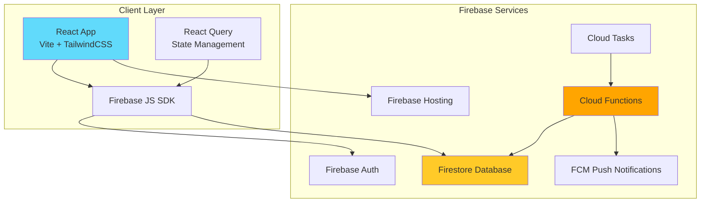

# Design Document

## Overview

The Habit Experiment App MVP is a full-stack web application built with React frontend and Firebase backend services. The architecture follows a serverless model using Firebase Authentication, Firestore database, Cloud Functions for business logic, and Firebase Cloud Messaging for notifications. The system is designed for scalability, offline-first functionality, and real-time data synchronization.

## Architecture

### High-Level Architecture



### Technology Stack

**Frontend:**
- React 18 with Vite for fast development and optimized builds
- React Router v6 for client-side routing
- React Query (TanStack Query) for server state management and caching
- Firebase JS SDK v9+ (modular) for authentication and Firestore access
- TailwindCSS for utility-first styling
- Day.js for date manipulation

**Backend:**
- Node.js 18+ runtime for Cloud Functions
- Firebase Admin SDK for server-side operations
- Cloud Functions (2nd gen) for serverless compute
- Cloud Tasks for scheduled notifications
- Firebase Cloud Messaging for push notifications

**Database:**
- Firestore with offline persistence enabled
- Optimized document structure for minimal reads

## Components and Interfaces

### Frontend Components

#### 1. Authentication Components

**LoginPage**
- Purpose: Handle user authentication
- Props: None
- State: email, password, loading, error
- Methods:
  - `handleEmailLogin()`: Authenticate with email/password
  - `handleGoogleLogin()`: Authenticate with Google OAuth
- Firebase Integration: `signInWithEmailAndPassword()`, `signInWithPopup()`

**SignupPage**
- Purpose: New user registration
- Props: None
- State: email, password, confirmPassword, loading, error
- Methods:
  - `handleSignup()`: Create new user account
  - `createUserProfile()`: Initialize user document in Firestore
- Firebase Integration: `createUserWithEmailAndPassword()`

**AuthGuard**
- Purpose: Protected route wrapper
- Props: children (React nodes)
- Methods:
  - `checkAuthState()`: Verify user authentication
  - `redirectToLogin()`: Redirect unauthenticated users
- Firebase Integration: `onAuthStateChanged()`

#### 2. Habit Management Components

**Dashboard**
- Purpose: Display all user habits and quick stats
- Props: None
- State: habits (array), loading, error
- Methods:
  - `fetchHabits()`: Load user's habit experiments
  - `navigateToHabit()`: Route to habit detail page
- Data Source: Firestore query `/users/{uid}/habits`

**CreateHabitForm**
- Purpose: Create new habit experiment
- Props: onSuccess (callback)
- State: habitName, frequency, duration, reminderTime, loading, error
- Validation:
  - Habit name: 1-100 characters, required
  - Frequency: daily or specific weekdays
  - Duration: default 30 days
  - Reminder time: optional, HH:MM format
- Methods:
  - `validateForm()`: Client-side validation
  - `submitHabit()`: Create habit document
- Firebase Integration: `addDoc()` to `/users/{uid}/habits`

**HabitDetailPage**
- Purpose: Display single habit with analytics
- Props: habitId (from route params)
- State: habit, analytics, checks, loading, error
- Methods:
  - `fetchHabitData()`: Load habit, analytics, and recent checks
  - `handleCheckIn()`: Trigger daily check-in
- Data Source: 
  - `/users/{uid}/habits/{habitId}`
  - `/users/{uid}/habits/{habitId}/analytics`
  - `/users/{uid}/habits/{habitId}/checks`

#### 3. Check-In Components

**CheckInButton**
- Purpose: One-tap habit completion
- Props: habitId, date, isCompleted
- State: loading, optimisticComplete
- Methods:
  - `handleCheckIn()`: Optimistic UI update + Firestore write
  - `rollbackOnError()`: Revert UI if write fails
- Firebase Integration: `setDoc()` to `/users/{uid}/habits/{habitId}/checks/{dateKey}`
- Optimistic UI: Immediately show completed state, rollback on error

#### 4. Analytics Components

**StreakDisplay**
- Purpose: Show current and longest streak
- Props: currentStreak, longestStreak
- Rendering: Large numbers with labels

**CompletionRateCard**
- Purpose: Display completion percentage
- Props: completionRate, totalDays, completedDays
- Rendering: Percentage with progress bar

**TimelineGraph**
- Purpose: 30-day visual timeline
- Props: checks (array of dates), startDate
- Rendering: Grid of 30 cells, colored by completion status
- Methods:
  - `generateDateRange()`: Create 30-day array
  - `isDateCompleted()`: Check if date has check-in

### Backend Cloud Functions

#### 1. createHabit (Callable Function)

**Purpose:** Create new habit experiment with validation

**Input:**
```typescript
{
  habitName: string;
  frequency: 'daily' | string[]; // array of weekday names
  duration: number; // default 30
  reminderTime?: string; // HH:MM format
}
```

**Process:**
1. Validate authentication context
2. Validate input parameters
3. Create habit document in Firestore
4. Initialize analytics document with zero values
5. If reminderTime provided, schedule Cloud Task
6. Return habitId

**Output:**
```typescript
{
  habitId: string;
  success: boolean;
}
```

#### 2. onCheckWrite (Firestore Trigger)

**Purpose:** Update analytics when check-in is created

**Trigger:** `onCreate` on `/users/{uid}/habits/{habitId}/checks/{dateKey}`

**Process:**
1. Fetch all checks for habit
2. Calculate current streak (consecutive days from today backward)
3. Calculate longest streak (max consecutive days in history)
4. Calculate completion rate (completed days / total days since start)
5. Update analytics document atomically

**Analytics Calculation Logic:**
```javascript
// Current Streak
let currentStreak = 0;
let checkDate = today;
while (checksMap.has(checkDate)) {
  currentStreak++;
  checkDate = subtractDay(checkDate);
}

// Longest Streak
let longestStreak = 0;
let tempStreak = 0;
for (let date of sortedDates) {
  if (isConsecutive(date, previousDate)) {
    tempStreak++;
  } else {
    longestStreak = Math.max(longestStreak, tempStreak);
    tempStreak = 1;
  }
}

// Completion Rate
const totalDays = daysBetween(habitStartDate, today);
const completedDays = checks.length;
const completionRate = (completedDays / totalDays) * 100;
```

#### 3. sendReminder (Scheduled Function)

**Purpose:** Send push notifications at scheduled times

**Trigger:** Cloud Task scheduled by createHabit

**Process:**
1. Query habits with reminder time matching current hour
2. For each habit, check if user has completed today's check-in
3. If not completed, send FCM notification
4. Log notification delivery status

**FCM Payload:**
```javascript
{
  notification: {
    title: "Time for your habit!",
    body: `Don't forget: ${habitName}`,
    icon: "/icon.png"
  },
  data: {
    habitId: habitId,
    action: "check-in"
  },
  token: userFCMToken
}
```

**Scheduling Strategy:**
- Use Cloud Scheduler to trigger function hourly
- Function filters habits by reminder time
- Idempotent: checks if already completed today

## Data Models

### Firestore Schema

#### /users/{uid}
```typescript
{
  uid: string;
  email: string;
  displayName?: string;
  createdAt: Timestamp;
  fcmToken?: string; // for push notifications
}
```

#### /users/{uid}/habits/{habitId}
```typescript
{
  habitId: string;
  habitName: string;
  frequency: 'daily' | string[]; // ['monday', 'wednesday', 'friday']
  duration: number; // 30
  reminderTime?: string; // "09:00"
  startDate: Timestamp;
  createdAt: Timestamp;
  isActive: boolean;
}
```

#### /users/{uid}/habits/{habitId}/checks/{dateKey}
```typescript
{
  dateKey: string; // "2025-11-15"
  completedAt: Timestamp;
  habitId: string;
}
```
**Note:** dateKey is the document ID for efficient lookups

#### /users/{uid}/habits/{habitId}/analytics
```typescript
{
  currentStreak: number;
  longestStreak: number;
  completionRate: number; // 0-100
  totalDays: number;
  completedDays: number;
  lastUpdated: Timestamp;
}
```

### Data Access Patterns

**Pattern 1: Load Dashboard**
- Query: `/users/{uid}/habits` (limit 10)
- For each habit, read `/users/{uid}/habits/{habitId}/analytics`
- Optimization: Use React Query to cache and batch requests

**Pattern 2: Daily Check-In**
- Write: `/users/{uid}/habits/{habitId}/checks/{dateKey}`
- Trigger: onCheckWrite Cloud Function
- Update: `/users/{uid}/habits/{habitId}/analytics`

**Pattern 3: View Habit Timeline**
- Query: `/users/{uid}/habits/{habitId}/checks` (orderBy dateKey, limit 30)
- Read: `/users/{uid}/habits/{habitId}/analytics`
- Optimization: Use Firestore offline cache

## Error Handling

### Frontend Error Handling

**Authentication Errors:**
- `auth/user-not-found`: Display "No account found with this email"
- `auth/wrong-password`: Display "Incorrect password"
- `auth/email-already-in-use`: Display "Email already registered"
- `auth/weak-password`: Display "Password must be at least 6 characters"

**Firestore Errors:**
- `permission-denied`: Redirect to login
- `unavailable`: Display "Connection lost, changes will sync when online"
- `not-found`: Display "Habit not found"

**Check-In Errors:**
- Network failure: Keep optimistic UI, retry in background
- Duplicate check-in: Display "Already completed today"
- Rate limit: Display "Too many requests, please wait"

### Backend Error Handling

**Cloud Function Error Patterns:**
```javascript
try {
  // Function logic
} catch (error) {
  console.error('Function error:', error);
  
  if (error.code === 'permission-denied') {
    throw new functions.https.HttpsError('permission-denied', 'Unauthorized');
  }
  
  if (error.code === 'not-found') {
    throw new functions.https.HttpsError('not-found', 'Resource not found');
  }
  
  throw new functions.https.HttpsError('internal', 'An error occurred');
}
```

**Retry Logic:**
- Firestore writes: Automatic retry with exponential backoff (Firebase SDK)
- FCM notifications: Retry up to 3 times with 1-minute delay
- Cloud Tasks: Automatic retry with exponential backoff (max 7 days)

## Testing Strategy

### Frontend Testing

**Unit Tests (Vitest):**
- Component rendering and props
- Form validation logic
- Date utility functions
- Analytics calculation helpers

**Integration Tests:**
- Authentication flow (mock Firebase Auth)
- Habit creation flow (mock Firestore)
- Check-in with optimistic UI
- Analytics display with mock data

**E2E Tests (Playwright - Optional):**
- Complete user journey: signup → create habit → check-in → view analytics
- Offline functionality
- Notification permission flow

### Backend Testing

**Cloud Function Tests:**
- Unit tests for analytics calculation logic
- Integration tests with Firestore emulator
- Test error handling and edge cases
- Test rate limiting

**Test Data:**
```javascript
// Mock habit with 10 consecutive check-ins
const mockChecks = generateConsecutiveChecks(10);

// Test current streak calculation
expect(calculateCurrentStreak(mockChecks, today)).toBe(10);

// Test with gap in streak
const checksWithGap = [...mockChecks.slice(0, 5), ...generateChecks(today)];
expect(calculateCurrentStreak(checksWithGap, today)).toBe(1);
```

### Security Testing

**Firestore Rules Testing:**
- Verify users can only read/write their own data
- Test unauthenticated access is denied
- Test cross-user access is blocked

**Example Test:**
```javascript
// User A cannot read User B's habits
await assertFails(
  getDoc(db, 'users/userB/habits/habit1')
    .withAuth({ uid: 'userA' })
);
```

## Performance Optimization

### Frontend Optimizations

1. **Code Splitting:** Lazy load routes with React.lazy()
2. **React Query Caching:** Cache habit and analytics data for 5 minutes
3. **Optimistic Updates:** Immediate UI feedback for check-ins
4. **Image Optimization:** Use WebP format, lazy loading
5. **Bundle Size:** Tree-shake unused Firebase modules

### Backend Optimizations

1. **Firestore Indexing:** Composite index on (uid, createdAt) for habit queries
2. **Analytics Denormalization:** Store computed values in analytics document
3. **Batch Operations:** Use batch writes for multiple updates
4. **Cloud Function Cold Start:** Use 2nd gen functions with min instances = 0
5. **Caching:** Cache user FCM tokens in memory during function execution

### Database Optimization

**Read Minimization:**
- Store analytics as summary document (1 read vs N reads of checks)
- Use Firestore offline persistence to reduce network reads
- Limit queries to necessary fields only

**Write Optimization:**
- Batch analytics updates
- Use transactions for concurrent updates
- Avoid unnecessary writes (check if value changed)

## Security Considerations

### Firestore Security Rules

```javascript
rules_version = '2';
service cloud.firestore {
  match /databases/{database}/documents {
    // User documents
    match /users/{uid} {
      allow read, write: if request.auth != null && request.auth.uid == uid;
      
      // Habits subcollection
      match /habits/{habitId} {
        allow read, write: if request.auth != null && request.auth.uid == uid;
        
        // Checks subcollection
        match /checks/{dateKey} {
          allow read, write: if request.auth != null && request.auth.uid == uid;
        }
        
        // Analytics subcollection
        match /analytics/{document=**} {
          allow read: if request.auth != null && request.auth.uid == uid;
          allow write: if false; // Only Cloud Functions can write
        }
      }
    }
  }
}
```

### Authentication Security

- Enforce email verification for email/password signups
- Use Firebase Auth session management
- Implement CSRF protection via Firebase SDK
- Store minimal user data (no sensitive information)

### API Security

- Rate limit Cloud Functions: 100 requests/user/minute
- Validate all input parameters
- Sanitize user-generated content (habit names)
- Use HTTPS only (enforced by Firebase Hosting)

## Deployment Strategy

### Development Environment

1. Local development with Firebase Emulators
2. Emulate Auth, Firestore, and Cloud Functions
3. Use `.env.local` for Firebase config

### Production Deployment

1. **Frontend:** Deploy to Firebase Hosting
   ```bash
   npm run build
   firebase deploy --only hosting
   ```

2. **Cloud Functions:** Deploy with Firebase CLI
   ```bash
   firebase deploy --only functions
   ```

3. **Firestore Rules:** Deploy security rules
   ```bash
   firebase deploy --only firestore:rules
   ```

4. **Environment Variables:** Set via Firebase CLI
   ```bash
   firebase functions:config:set fcm.key="..."
   ```

### CI/CD Pipeline (Future)

- GitHub Actions for automated testing
- Deploy to staging environment on PR
- Deploy to production on merge to main
- Run E2E tests before production deployment

## Monitoring and Analytics

### Application Monitoring

- Firebase Performance Monitoring for page load times
- Cloud Functions logs via Firebase Console
- Error tracking with console.error() in functions
- Custom metrics: check-in rate, streak distribution

### User Analytics

- Track activation: % users who create first habit
- Track engagement: daily check-in rate
- Track retention: Day 7, Day 30 retention
- Track completion: % users who complete 30-day experiment

### Alerts

- Cloud Function error rate > 5%
- Firestore read/write quota approaching limit
- FCM notification delivery failure rate > 10%
